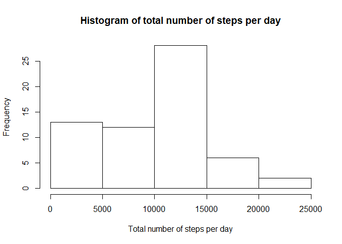
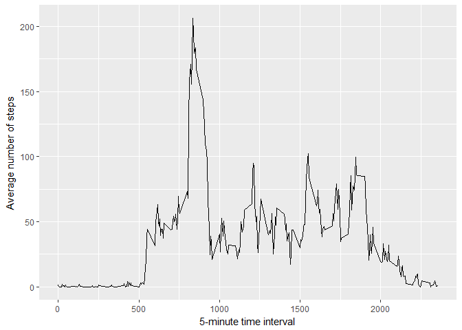
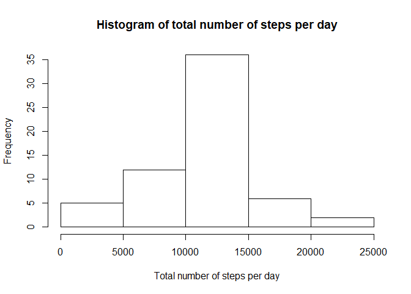
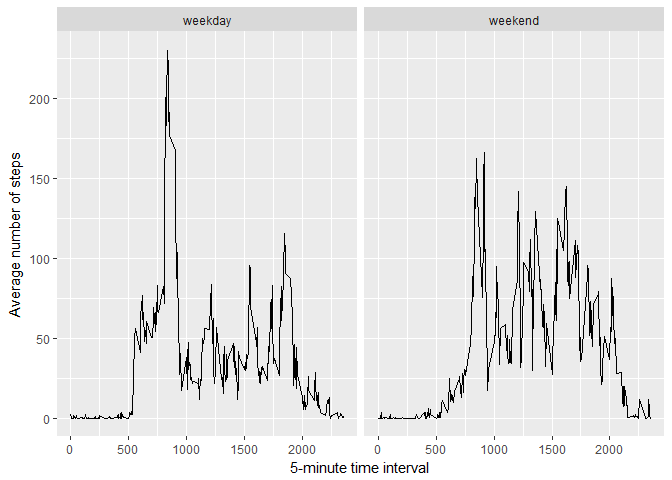

## Loading and preprocessing the data
First, I load the packages I will use to process the data

```r
library('tidyverse')
```

```
## -- Attaching packages -- tidyverse 1.2.1 --
```

```
## v ggplot2 2.2.1     v purrr   0.2.4
## v tibble  1.4.2     v dplyr   0.7.4
## v tidyr   0.8.0     v stringr 1.2.0
## v readr   1.1.1     v forcats 0.2.0
```

```
## Warning: package 'readr' was built under R version 3.4.4
```

```
## -- Conflicts ----- tidyverse_conflicts() --
## x dplyr::filter() masks stats::filter()
## x dplyr::lag()    masks stats::lag()
```

```r
library('lubridate')
```

```
## 
## Attaching package: 'lubridate'
```

```
## The following object is masked from 'package:base':
## 
##     date
```
Then I load the data from the file into R, and convert the date formar to make it more usable in the next steps

```r
data <- read_csv('activity.csv')
```

```
## Parsed with column specification:
## cols(
##   steps = col_integer(),
##   date = col_date(format = ""),
##   interval = col_integer()
## )
```

```r
#Transform the date into an appropriate format
data$date <- ymd(data$date)
```
## What is mean total number of steps taken per day?
This code takes the data, and calculates the total sum of steps for each day. It then plots the data as a histogram, as well as calculating the mean and the median of the total steps per day

```r
data %>% group_by(date) %>% summarise_at('steps', sum, na.rm = T) -> total_steps_per_day


hist(total_steps_per_day$steps, main ='Histogram of total number of steps per day', xlab = 'Total number of steps per day')
```

<!-- -->

```r
mean(total_steps_per_day$steps)
```

```
## [1] 9354.23
```

```r
median(total_steps_per_day$steps)
```

```
## [1] 10395
```


## What is the average daily activity pattern?
Now instead of looking at the total activity per day, I will look at the mean activity per time window. NAs were removed for the calculations.
I also found the time interval where the activity is higher on average

```r
data %>% group_by(interval) %>% summarise_at('steps', mean, na.rm = T) -> average_by_time

p <- ggplot(average_by_time, aes(x = interval, y = steps))
p + geom_line() + xlab('5-minute time interval') + ylab('Average number of steps')
```

<!-- -->

```r
max_steps <-max(average_by_time$steps)
average_by_time[which(average_by_time$steps == max_steps),]
```

```
## # A tibble: 1 x 2
##   interval steps
##      <int> <dbl>
## 1      835   206
```


## Imputing missing values
The steps data contains a lot of missing values. To input them, I will use the average data for that time period. 
Afterwards, I calculated the total number of steps per day for the new input data. I then plotted them as a histogram. The mean and median of the dataset are available below

```r
sum(is.na(data$steps))
```

```
## [1] 2304
```

```r
input_data <-merge(data, average_by_time, by = 'interval', all.y = T)
input_data[is.na(input_data$steps.x),]$steps.x <- input_data[is.na(input_data$steps.x),]$steps.y
input_data <- select(input_data, -steps.y)
colnames(input_data)[2] <- 'steps'

input_data %>% group_by(date) %>% summarise_at('steps', sum, na.rm = T) -> input_total_steps_per_day


hist(input_total_steps_per_day$steps, main ='Histogram of total number of steps per day', xlab = 'Total number of steps per day')
```

<!-- -->

```r
mean(input_total_steps_per_day$steps)
```

```
## [1] 10766.19
```

```r
median(input_total_steps_per_day$steps)
```

```
## [1] 10766.19
```

## Are there differences in activity patterns between weekdays and weekends?
To answer this question, I separated the input data into two groups: acquired on a weekend or during the week. Then I calculated the average number of steps for each time interval. I plotted both in two separate panels to show the difference in activity between the two type of days. 

```r
input_data$weekday <- wday(input_data$date, label = T)
input_data$weekend <- ifelse(input_data$weekday == 'Sat' | input_data$weekday == 'Sun','weekend','weekday')


input_data %>% group_by(interval, weekend) %>% summarise_at('steps', mean, na.rm = T) -> average_by_weekend

p <- ggplot(average_by_weekend, aes(x = interval, y = steps))
p + geom_line() + xlab('5-minute time interval') + ylab('Average number of steps') + facet_wrap(~weekend)
```

<!-- -->
